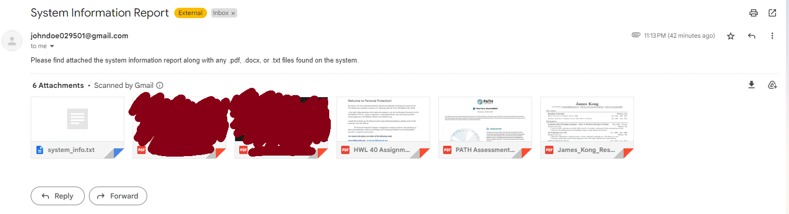
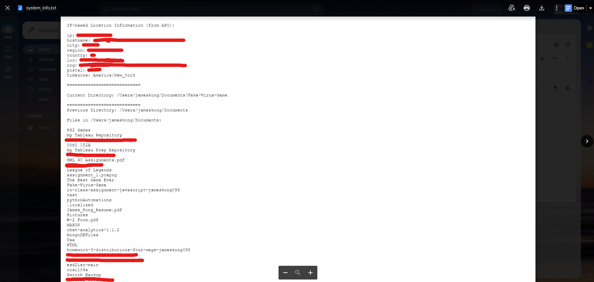
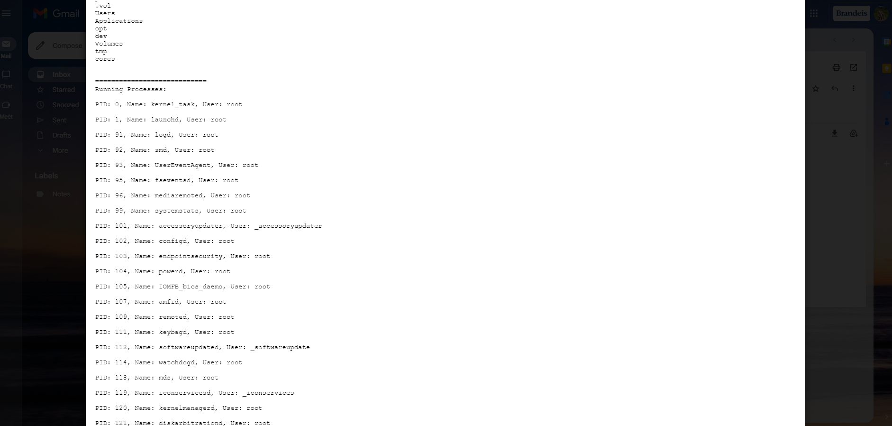
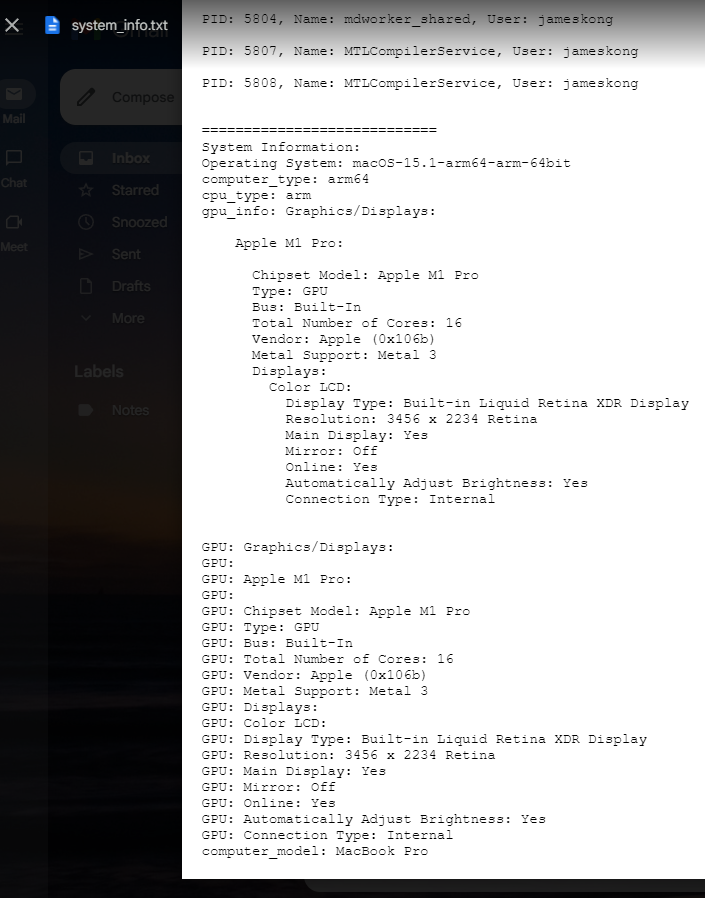

# Sherman Dining: The Game


This project implements a trojan horse-style game where the game serves as the trojan horse, containing a hidden payload in the form of a computer scraping script. The game acts as a distraction while the script quietly gathers information about the user's system and automatically sends it to a designated email address.






## Disclaimer

This project is intended for educational purposes only. The use of this software for malicious purposes is strictly prohibited. The developers assume no responsibility for any misuse of this software.

## Features

- **Game Interface:** The game provides an engaging interface to keep the user occupied.
- **Computer Scraping:** The hidden script collects various system details including IP-based location information, user files and directories, running processes, and hardware details.
- **Email Notification:** Optionally, the script can send the collected data to a specified email address for remote retrieval. This even includes copies of .pdf, .docx, and .txt files found on the user's computer.

## How it Works

1. **Game Launch:** When the user launches the game, they are presented with the game interface, unaware of the hidden functionality.
2. **Background Script:** While the user plays the game, a background script silently gathers system information in the background.
3. **Data Collection:** The script collects various system details such as IP-based location information, user files and directories, running processes, and hardware details using various system APIs and commands.
4. **Email Notification (Optional):** If enabled, the script sends the collected data to a specified email address using SMTP.
5. **Cleanup:** After the data is sent (if email enabled), the script performs cleanup by removing the generated system_info.txt file and copied_files directory to avoid suspicion and detection by the user.

## Usage

1. Clone the repository to your local machine.
2. Run the Sherman_Dining_The_Game.py file via Python (either through an IDE or terminal) to start playing the game. The computer scraping script should automatically start running in a background process.
3. Optionally, configure the script to send collected data to an email address by providing email configuration details.
4. View the generated system_info.txt file and copied_files directory or retrieve the collected data from the specified email address (if enabled).

## Configuration

**.env file template:**
```python
enable_email = ""
sender_email = ""
receiver_email = ""
password = ""
smtp_server = ""
smtp_port = ""
max_attachment_size_mb = ""
max_copy_amount = ""
enable_debug_prints = ""
enable_delete_generated_files = ""
```

## Requirements

- Python 3.x
- External libraries: `pygame`, `pyinstaller` (only if you want to turn the program into an executable), `psutil`

## Credits

James D. Kong - Game Programmer / Computer Scraping Scripter 

Eric Hurchey - Computer Scraping Scripter

## License

This project is licensed under the MIT License. See the [LICENSE](LICENSE) file for details.
